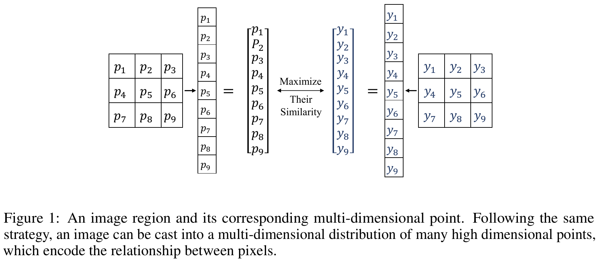
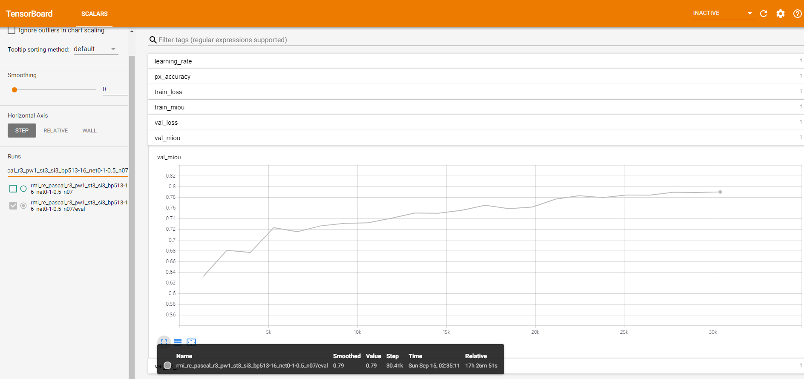
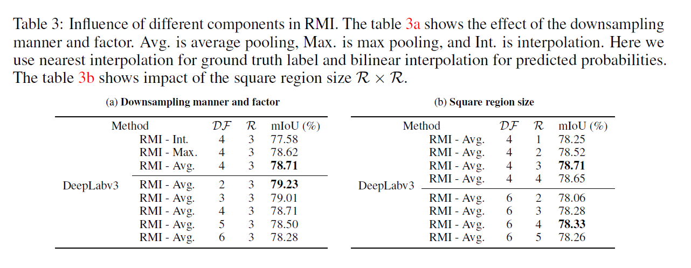
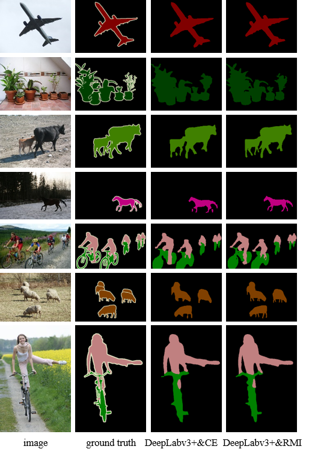

# Region Mutual Information Loss for Semantic Segmentation

##  Table of Contents

<!--ts-->
* [Introduction](#Introduction)
* [Features and TODO](#Features-and-TODO)
* [Installation](#Installation)
* [Training](#Training)
* [Evaluation and Inference](#Evaluation-and-Inference)
* [Experiments](#Experiments)
* [Citations](#Citations)
* [Acknowledgements](#Acknowledgements)
<!--te-->

## Introduction

This is the code for the NeurIPS 2019 paper [Region Mutual Information Loss for Semantic Segmentation](https://arxiv.org/abs/1910.12037).

This paper proposes a region mutual information (RMI) loss to model the dependencies among pixels. RMI uses one pixel and its neighbor pixels to represent this pixel. Then for each pixel in an image, we get a multi-dimensional point that encodes the relationship between pixels, and the image is cast into a multi-dimensional distribution of these high-dimensional points. The prediction and ground truth thus can achieve high order consistency through maximizing the mutual information (MI) between their multi-dimensional distributions.



## Features and TODO

- [x] Support different segmentation models, i.e., DeepLabv3, DeepLabv3+, PSPNet
- [x] Multi-GPU training
- [x] Multi-GPU Synchronized BatchNorm
- [ ] Support different backbones, e.g., Mobilenet, Xception
- [ ] Model pretrained on MS-COCO
- [ ] Distributed training

We are open to pull requests.

## Installation

### Install dependencies

Please install PyTorch-1.1.0 and Python3.6.5.
We highly recommend you to use our established PyTorch docker image - [zhaossss/torch_lab](https://hub.docker.com/r/zhaosssss/torch_lab).
```
docker pull zhaosssss/torch_lab:1.1.0
```
If you have not installed docker, see https://docs.docker.com/. 

After you install docker and pull our image, you can `cd` to `script` directory and run
```
./docker.sh
```
to create a running docker container.

If you do not want to use docker, try
```
pip install -r requirements.txt
```
However, this is not suggested.


### Prepare data

Generally, directories are organized as follow:
```
|
|--dataset (save the dataset) 
|--models  (save the output checkpoints)
|--github  (save the code)
|--|
|--|--RMI  (the RMI code repository)
|--|--|--crf
|--|--|--dataloaders
|--|--|--losses
...
```


- Download [PASCAL VOC training/validation data](http://host.robots.ox.ac.uk/pascal/VOC/voc2012/VOCtrainval_11-May-2012.tar) 
(2GB tar file) and [augmented segmentation data](https://www.dropbox.com/s/oeu149j8qtbs1x0/SegmentationClassAug.zip?dl=0), extract and put them in the `dataset` directory.

- `cd` to `github` directory and clone the RMI repo.

As for the CamVid dataset, you can download at [SegNet-Tutorial](https://github.com/alexgkendall/SegNet-Tutorial). This is a processed version of [original CamVid dataset](http://mi.eng.cam.ac.uk/research/projects/VideoRec/CamVid/).

## Training

See `script/train.sh` for detailed information.
Before start training, you should specify some variables in the `script/train.sh`.

- `pre_dir`, where you save your output checkpoints. If you organize the dir as we suggest, it should be `pre_dir=models`.

- `data_dir`, where you save your dataset. Besides, you should put the lists of the images in the dataset in a certain directory, check `dataloaders/datasets/pascal.py` to find how we organize the input pipeline.

You can find more information about the arguments of the code in `parser_params.py`.
```
python parser_params.py --help

usage: parser_params.py [-h] [--resume RESUME] [--checkname CHECKNAME]
                        [--save_ckpt_steps SAVE_CKPT_STEPS]
                        [--max_ckpt_nums MAX_CKPT_NUMS]
                        [--model_dir MODEL_DIR] [--output_dir OUTPUT_DIR]
                        [--seg_model {deeplabv3,deeplabv3+,pspnet}]
                        [--backbone {resnet50,resnet101,resnet152,resnet50_beta,resnet101_beta,resnet152_beta}]
                        [--out_stride OUT_STRIDE] [--batch_size N]
                        [--accumulation_steps N] [--test_batch_size N]
                        [--dataset {pascal,coco,cityscapes,camvid}]
                        [--train_split {train,trainaug,trainval,val,test}]
                        [--data_dir DATA_DIR] [--use_sbd] [--workers N]
                        ...
                        [--rmi_pool_size RMI_POOL_SIZE]
                        [--rmi_pool_stride RMI_POOL_STRIDE]
                        [--rmi_radius RMI_RADIUS]
                        [--crf_iter_steps CRF_ITER_STEPS]
                        [--local_rank LOCAL_RANK] [--world_size WORLD_SIZE]
                        [--dist_backend DIST_BACKEND]
                        [--multiprocessing_distributed]
```


After you set all the arguments properly, you can simply `cd` to `RMI/script`  and run
```
./train.sh
```
to start training.

* Monitoring the training process through tensorboard

```
tensorboard --logdir=your_logdir --port=your_port
```



* GPU memory usage

Training a DeepLabv3 model with `output_stride=16`, `crop_size=513`, and `batch_size=16`  needs 4 GTX 1080 GPUs (8GB)
or 2 GTX TITAN X GPUs (12 GB) or 1 TITAN RTX GPUs (24 GB).  


## Evaluation and Inference

See `script/eval.sh` and `script/inference.sh` for detailed information.

You should also specify some variables in the scripts.

- `data_dir`, where you save your dataset.

- `resume`, where your checkpoints locate.

- `output_dir`, where the output data will be saved.

Then run 
```
./eval.sh
```
or
```
./inference.sh
```


## Experiments






Some selected qualitative results on PASCAL VOC 2012 val set.
Segmentation results of DeepLabv3+&RMI have richer details than DeepLabv3+&CE, e.g., small bumps of the airplane wing, branches of plants, limbs of cows and sheep, and so on.


## Citations

If our paper and code are beneficial to your work, please cite:
```
@inproceedings{zhao2019rmi,
    title={Region Mutual Information Loss for Semantic Segmentation},
    author={Shuai Zhao, Yang Wang, Zheng Yang, Deng Cai},
    booktitle={NeurIPS},
    year={2019}
}
```

If other related work in our code or paper also helps you, please cite the corresponding papers.

## Acknowledgements

<!--ts-->
* [PyTorch-Encoding](https://github.com/zhanghang1989/PyTorch-Encoding)
* [official-tensorflow-deeplab](https://github.com/tensorflow/models/tree/master/research/deeplab)
* [Synchronized-BatchNorm-PyTorch](https://github.com/vacancy/Synchronized-BatchNorm-PyTorch)
* [pytorch-deeplab-xception](https://github.com/jfzhang95/pytorch-deeplab-xception)
* [pydensecrf](https://github.com/lucasb-eyer/pydensecrf)
* [Adaptive_Affinity_Fields](https://github.com/twke18/Adaptive\_Affinity\_Fields)
* [rishizek-tensorflow-deeplab-v3-plus](https://github.com/rishizek/tensorflow-deeplab-v3-plus)
* [SegNet-Tutorial](https://github.com/alexgkendall/SegNet-Tutorial)
<!--te-->

